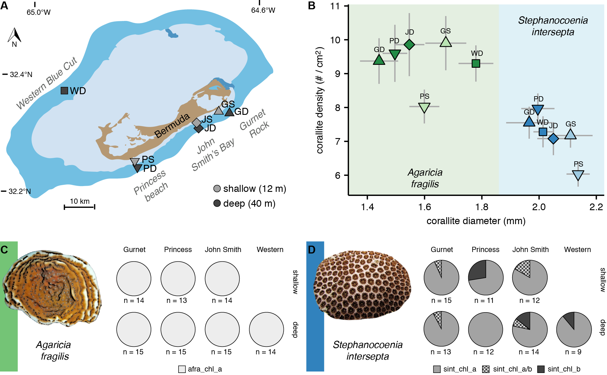
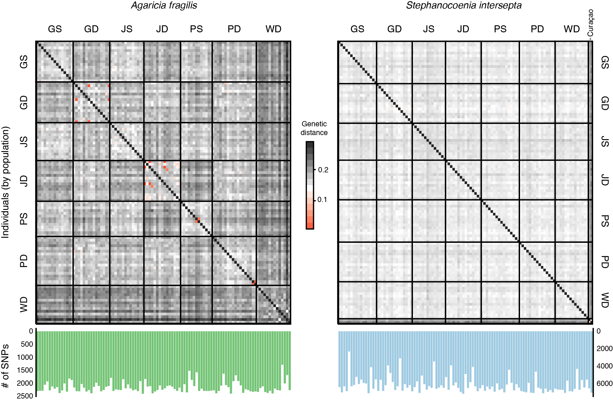
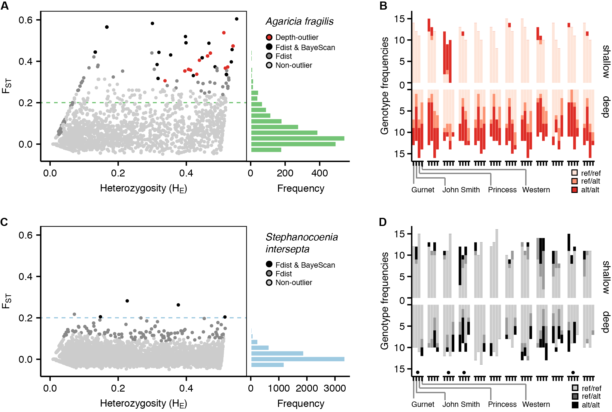
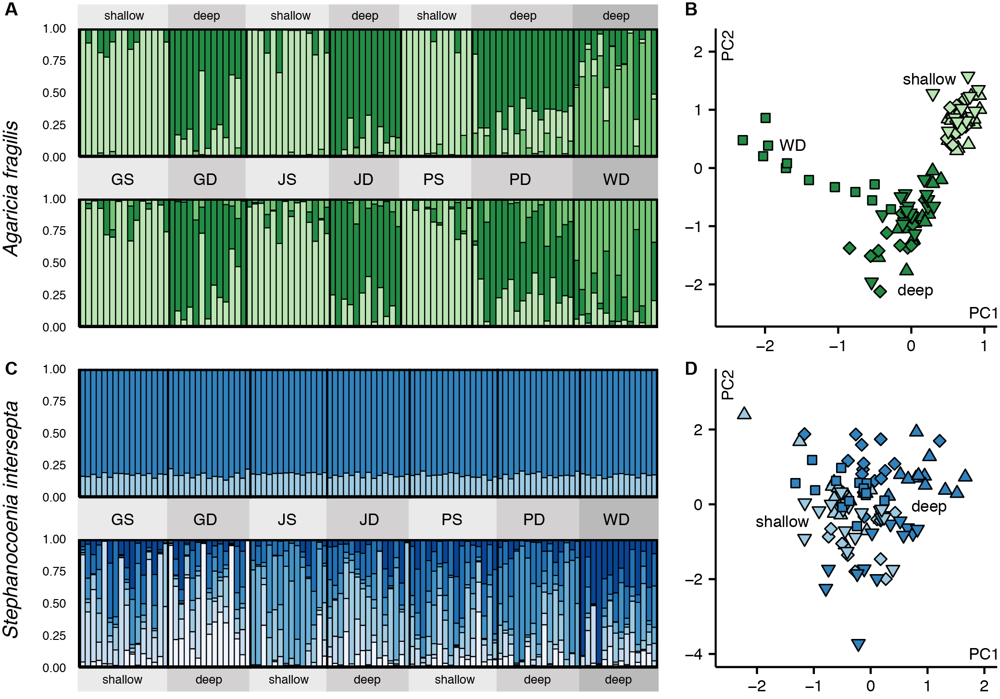
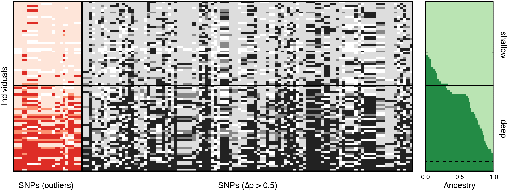
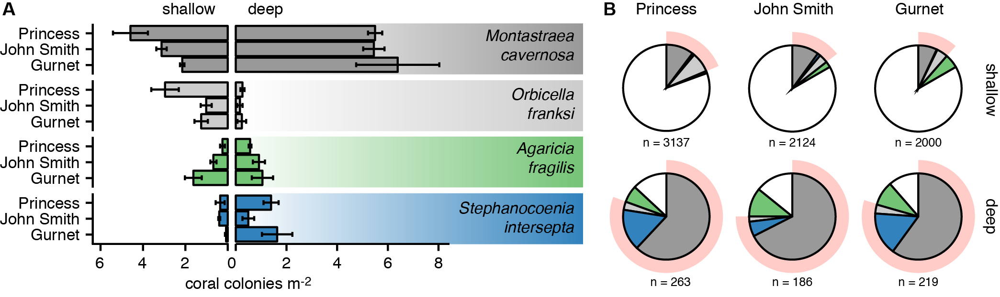
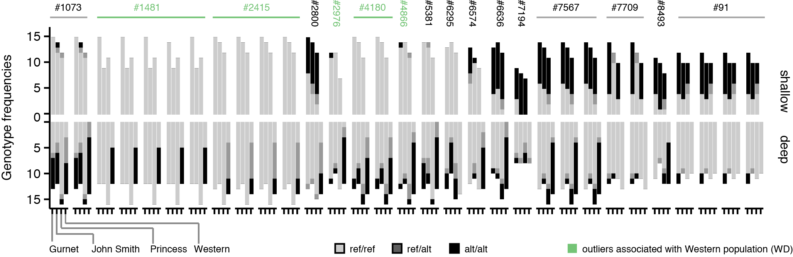
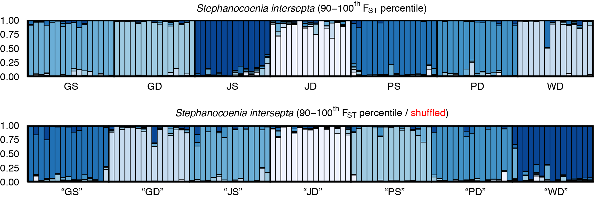

# D - Figures
*Contents:* Contains the data and scripts in R to produce the manuscript figures. *Notebook author:* Pim Bongaerts. 

*[Click here to go back to the overview](https://github.com/pimbongaerts/bermuda-rad/)*

* **[Figure 1](#figure-1)** Sampling locations, skeletal morphology and endosymbiont associations.
* **[Figure 2](#figure-2)** Pairwise genetic distances between individuals of *Agaricia fragilis and Stephanocoenia intersepta*.
* **[Figure 3](#figure-3)** Genetic differentiation and outlier SNPs. 
* **[Figure 4](#figure-4)** Genetic structuring across depths and locations.
* **[Figure 5](#figure-5)** Admixture between shallow and deep populations in *Agaricia fragilis*.
* **[Figure 6](#figure-6)** Depth-generalist species abundances and overlap in community structure.
* **[Figure S1](#supp-figure-s1)** Genotype frequencies of SNP outliers for *Agaricia fragilis*.
* **[Figure S2](#supp-figure-s2)** Genome-wide pairwise differentiation (FST) of populations.
* **[Figure S3](#supp-figure-s3)** Genetic structuring of *Stephanocoenia intersepta* populations based on most divergent SNPs.

*Note*: figures generated in R and then edited in Adobe Illustrator CC (edited versions shown here - original outputs included as PDFs)

##Figure 1
###Sampling locations, skeletal morphology and endosymbiont associations.
Plot generated with Adobe Illustrator - except for the morphometrics diagram (created with [figure1.R](FIG1/figure1.R); original plot: [figure1.png](FIG1/figure1.png))

	$ Rscript figure1.R

*Note:* Images of species modified from photos by the Florida Fish and Wildlife Conservation Commission (with permission).

##Figure 2
###Pairwise genetic distances between individuals of *Agaricia fragilis and Stephanocoenia intersepta*.
Plot generated with [figure2.R](FIG2/figure2.R) script and modified with Adobe Illustrator (original plot: [figure2.png](FIG2/figure2.png)):

	$ Rscript figure2.R

##Figure 3
###Genetic differentiation and outlier SNPs. 
Plot generated with [figure3.R](FIG3/figure3.R) script and modified with Adobe Illustrator (original plot: [figure3.png](FIG3/figure3.png))

	$ Rscript figure3.R

##Figure 4
###Genetic structuring across depths and locations.
Plot generated with [figure4.R](FIG4/figure4.R) script and modified with Adobe Illustrator (original plot: [figure4.png](FIG4/figure4.png))

	$ Rscript figure4.R

##Figure 5
###Admixture between shallow and deep populations in *Agaricia fragilis*.
Plot generated with [figure5.R](FIG5/figure5.R) script and modified with Adobe Illustrator (original plot: [figure5.png](FIG5/figure5.png))

	$ Rscript figure5.R

##Figure 6
###Depth-generalist species abundances and overlap in community structure.
Plot generated with [figure6.R](FIG6/figure6.R) script and modified with Adobe Illustrator (original plot: [figure6.png](FIG6/figure6.png))

	$ Rscript figure6.R

##Supp. figure S1
###Genotype frequencies of SNP outliers for *Agaricia fragilis*.
Plot generated with [figure_s1.R](SUPFIG1/figure_s1.R) script and modified with Adobe Illustrator (original plot: [figure_s1.png](SUPFIG1/figure_s1.png))

	$ Rscript figure_s1.R
	

##Supp. figure S2
###Genome-wide pairwise differentiation (FST) of populations.
Plot generated with [figure_s2.R](SUPFIG1/figure_s2.R) script and modified with Adobe Illustrator (original plot: [figure_s2.png](SUPFIG2/figure_s2.png))

	$ Rscript figure_s2.R
	

##Supp. figure S3
###Genetic structuring of *Stephanocoenia intersepta* populations based on most divergent SNPs.
Plot generated with [figure_s3.R](SUPFIG3/figure_s3.R) script and modified with Adobe Illustrator (original plot: [figure_s3.png](SUPFIG3/figure_s3.png))

	$ Rscript figure_s3.R
	
