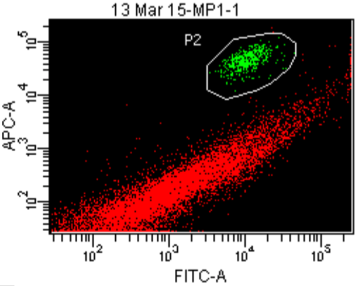

# F - Protocols
*Contents:*  - Details the lab protocols for gDNA isolation and fluorescence-activated cell sorting. *Notebook authors:* Pim Bongaerts, Kelly Latijnhouwers, Stijn den Haan, Ramona Brunner.

* **[DNA extraction protocol](#dna-extraction-protocol)**
* **[FACS *Symbiodinium* isolation protocol](#facs-symbiodinium-isolation-protocol)**

*[Click here to go back to the overview](https://github.com/pimbongaerts/bermuda-rad/)*

## DNA extraction protocol
DNA extraction method based on Wayne's method (Wilson et al. 2002) and modified for corals by **Lesa Peplow** at the Australian Institute of Marine Science. Here the protocol is further modified to include centrifugation steps to reduce *Symbiodinium* contamination.

Wilson, K. et al. 2002 Genetic mapping of the black tiger shrimp Penaeus monodon with amplified fragment length polymorphism. Aquaculture 204, 297–309. (doi:10.1016/S0044-8486(01)00842-0) 

### Extraction buffer
Extraction buffer for 24 samples (make up before starting extractions):

|Volume|Concentration|Chemical|Note|
|---|---|---|---|
|2 mL|1.0 M|Tris pH 9.0||
|4 mL|0.5 M|EDTA||
|400 uL|5.0 M|NaCl||
|2.29 mL||MilliQ||
|2 mL|10%|SDS|add this last|

### Other required chemicals
* MilliQ
* Proteinase K 20 mg/ml (500ul for 24 samples)
* KOAc 5M (5ml for 24 samples)
* RNAse A (250 ul for 24 samples)

### Protocol
#### Initial wash
* Take 4-5 small pieces (skeleton with tissue – “match head” size) of coral fragment – if preserved in salt-saturated DMSO/EDTA: dunk/wash in a well of a 96-well plate with sterile MilliQ (to reduce salts/mucus). If preserved in EtOH, washing with MilliQ is not required. 

#### Host-symbiont separation
* Transfer the skeleton pieces into 1.5 mL plastic microfuge tubes with 600uL sterile MilliQ water.
* Vortex tubes for 30 seconds to separate tissue from calcium carbonate skeleton. 
* Remove skeleton left-overs and mucus (if present), then centrifuge tubes for 15 minutes at 10K rpm (at RT).
* Transfer 450 uL of the supernatant to new microfuge tube without disturbing the pellet (containing larger/heavier Symbiodinium cells).
* Centrifuge tubes for 10 minutes at 10K rpm (at RT).

#### DNA extraction
* Transfer 350 uL of the supernatant (without disturbing the pellet) to new microfuge tube containing 0.4 mL extraction buffer (Optional: take 10 uL of supernatant and put on glass slide to verify absence of Symbiodinium cells under the microscope).
* Add 20 uL Proteinase K (20 mg/mL) to each sample.
* Shake samples vigorously.
* Place samples in 65°C water bath and incubate overnight (> 9 hours) - shake/invert after 1 hour of incubation.
* Add 187.5 uL of 5 M KOAc to each tube (giving a final concentration of 1 M) and mix.
* Incubate on ice 30 mins – ensure that the mixture is homogeneous.
* Spin for 15 minutes at 15K rpm (at RT) – re-homogenise the mixtures before placing them in the centrifuge.

#### RNAse A treatment
* Add 10uL RNAse A to new 1.5 mL microfuge tubes, then transfer supernatant (~800 uL) from tubes from previous step, homogenise and incubate in water bath at 37°C for 30 minutes.
DNA precipitation
* Add 640 uL isopropanol (640uL = 0.8 X vol) to precipitate the DNA. Mix gently and leave 15 minutes at RT.

#### Ethanol clean-up
* Spin for 15 mins at room temperature (15K rpm) – check whether DNA pellets have formed.
* Carefully remove supernatant, while keeping a close eye on the pellet (it may not stick well). Dry tube edge and lid with a kimwipe – do not place the tube upside down – and keep ~100 uL of liquid in the tube.
* Add 70% ethanol wash (200 uL) and re-spin for 5 minutes (14K rpm).
* Remove supernatant with extreme care and dry tube edge and lid on a kimwipe. If pellet is clearly visible and sticks well, the tube can be placed upside down to remove as much as liquid as possible.
* Add 70% ethanol wash (200 uL) and re-spin for 5 minutes (14K rpm).
* Remove supernatant with extreme care and dry tube edge/lid on a kimwipe (tube can be placed upside down if pellet sticks well).

#### Resuspension
* Put tubes in a rack and let air dry for 45-90 min – Place a cover over the tubes or place them in the laminar flow cabinet to prevent contamination. All liquid should have evaporated before the next step is taken.
* Resuspend pellet in 60 uL TE-buffer and leave DNA to resuspend overnight at 4°C.

## FACS *Symbiodinium* isolation protocol
Method for the isolation of *Symbiodinium* cells prior to DNA extraction using fluorescence-activated cell sorting (FACS). Conducted at the Queensland Brain Institute (The University of Queensland), with the help of Virginia Nink (Scientific Officer at QBI / UQ).

### FACS Cell Sorter
BD FACSAria Cell Sorter (BD Biosciences; 100 μm nozzle at 28 psi) - Queensland Brain Institute (QBI; The University of Queensland) using BD FACSDivaTM software 6.1.3. Single cell sort precision, with 488nm and 633nm lasers, using a 530/30 BP Filter for the 488nm laser and 660/20 BP Filter for the 633nm laser.

### Required chemicals for sample preparation
* MilliQ
* PBS (0.5 ml per sample)
* salt-saturated DMSO-EDTA (20% DMSO / 0.5M EDTA)

### Protocol
*Note:* Samples preserved in salt-saturated DMSO-EDTA buffer

#### Sample preparation
-	Per sample - gather 10-12 small fragments (size of matchhead), rinse in MilliQ and divide them equally over 3 microfuge tubes containing 0.5 ml MilliQ (creating 3 sample "aliquots")
-	Vortex each aliquot for 30 s (or: until no tissue is visibly left on the skeleton)
-	Remove skeleton, place it in new tube filled with small volume of MilliQ and vortex again (repeat step until there are no zoox in solution check under microscope)
- 	If present/possible, remove excess mucus from the tubes.
-	Centrifuge samples for 15 minutes at 10,000 RPM
-	Remove supernatant with a pipette and add 0.5 ml MilliQ to each sample. 
-	Re-suspend pellet by vortexing for 5 seconds (if necessary, help resuspend with pipette)
-	Centrifuge samples for 15 minutes at 10.000 RPM
-	Remove supernatant with a pipette and add 0.5 ml PBS to each sample
-	Re-suspend pellet by vortexing for 5 seconds
-	Prepare 3 collection tubes per aliquot: add 0.5 ml DMSO-EDTA per collection tube.

#### Fluorescence-activated cell sorting (QBI)
-	Resuspend each replicate with a pipette several minutes before processing in the cell sorter.
-	Filter sample through filter tubes (e.g. BD Falcon tubes with a cell strainer - or using autoclaved micron mesh 50um). If the sample is very turbid: add PBS until sample is almost transparent (although be aware: the more PBS you add, the lower the Symbiodinium concentration and the more separate collections will be needed)
-	Run samples through the flow cytometer. The *Symbiodinium* cells need to form a clearly distinguishable population based on their fluorescence (see below an example). Select the cell population and start the sorting process.
- Target is to have at least 300,000 isolated Symbiodinium cells for a single gDNA extraction (yields ~200 ng gDNA).

#### FACS scatter plot example

