# Fieldwork photos
*Contents:*  - Several panorama shots of the Bermuda seascape and photos of the fieldwork in Bermuda (with credit information after the caption). High-resolution versions can be found [here](original_size/) and additional B-roll video footage can be found [here](video_b_roll).

*[Click here to go back to the overview](https://github.com/pimbongaerts/bermuda-rad/)*

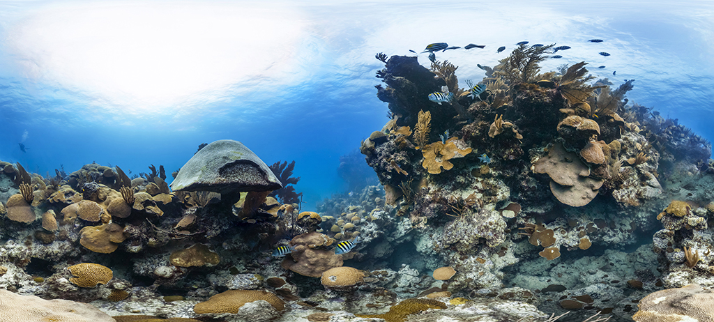
*Shallow reef at Emily's Pinnacles (Bermuda)* © The Ocean Agency / XL Catlin Seaview Survey / Christophe Bailhache

---

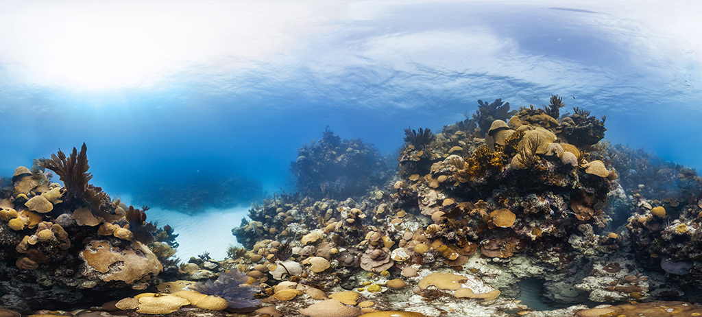
*Shallow reef at Emily's Pinnacles (Bermuda)* © The Ocean Agency / XL Catlin Seaview Survey / Christophe Bailhache

---

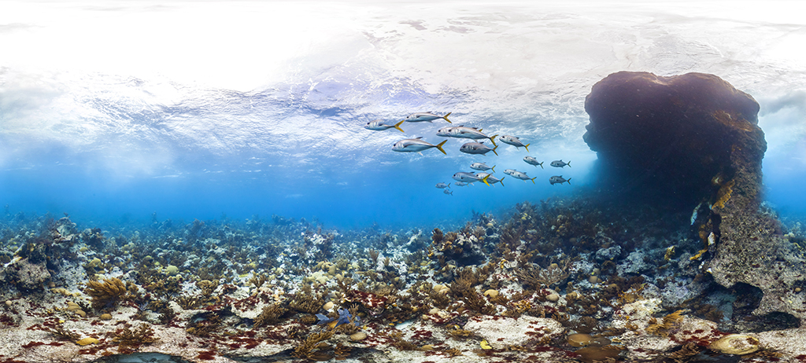
*Shallow reef at South West Breaker (Bermuda)* © The Ocean Agency / XL Catlin Seaview Survey / Christophe Bailhache

---

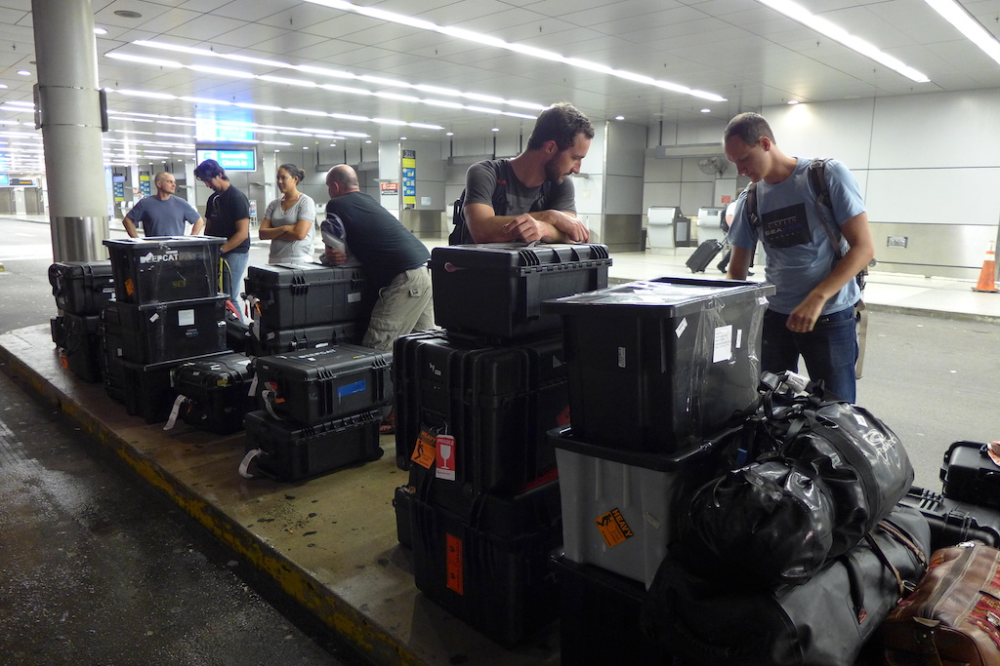 
*Travelling to Bermuda with the two Catlin Seaview Survey teams* © Global Change Institute - The University of Queensland

---

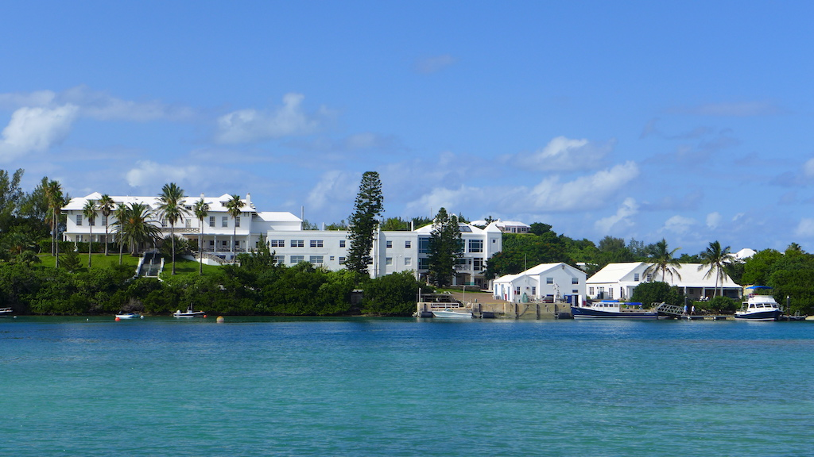 
*The [Bermuda Institute of Ocean Sciences](http://www.bios.edu/) (BIOS)* © Global Change Institute - The University of Queensland

---

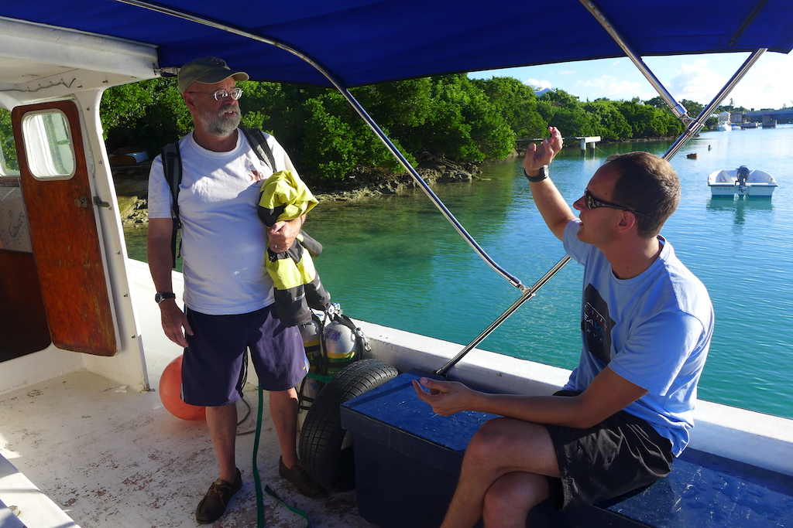 
*Struan (Robbie) Smith and Pim Bongaerts discussing the plan for the day* © Global Change Institute - The University of Queensland

---

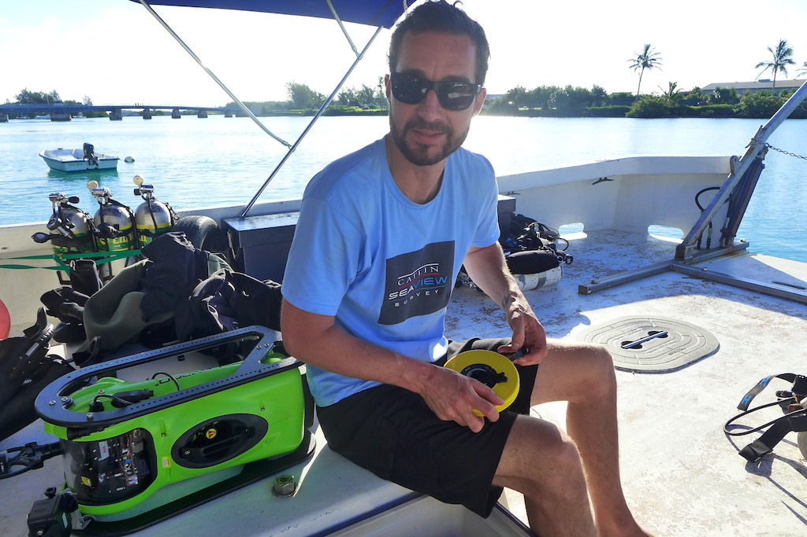 
*Norbert Englebert on the back deck* © Global Change Institute - The University of Queensland

---

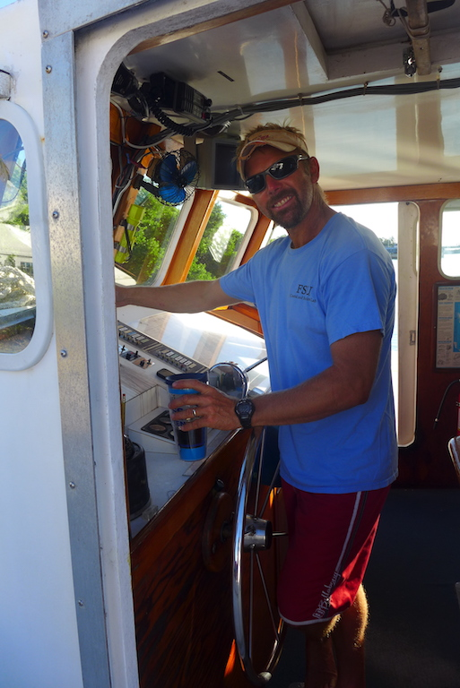 
*Alex Chequer skippering the boat* © Global Change Institute - The University of Queensland

---

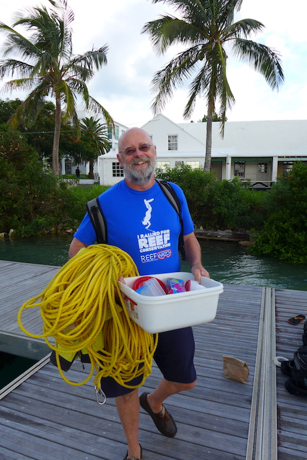 
*Struan (Robbie) Smith with enough rope for a deep shotline* © Global Change Institute - The University of Queensland

---

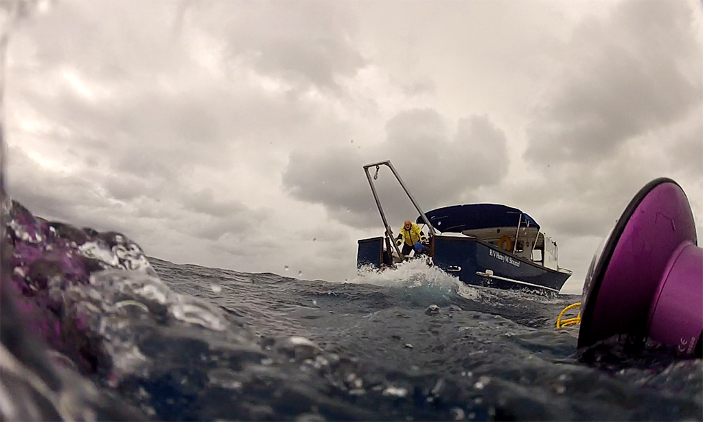 
*Diving John Smith's Bay during stormy Bermuda weather* © Global Change Institute - The University of Queensland

---

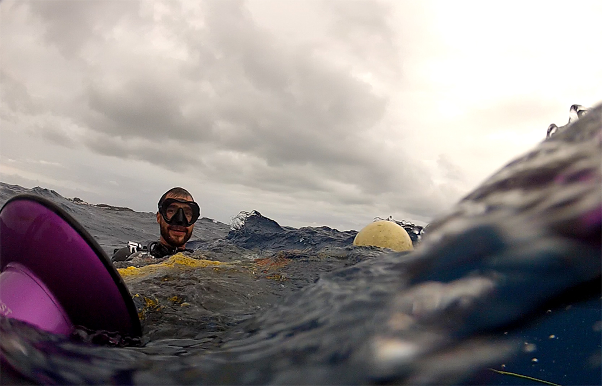 
*Diving John Smith's Bay during stormy Bermuda weather* © Global Change Institute - The University of Queensland

---

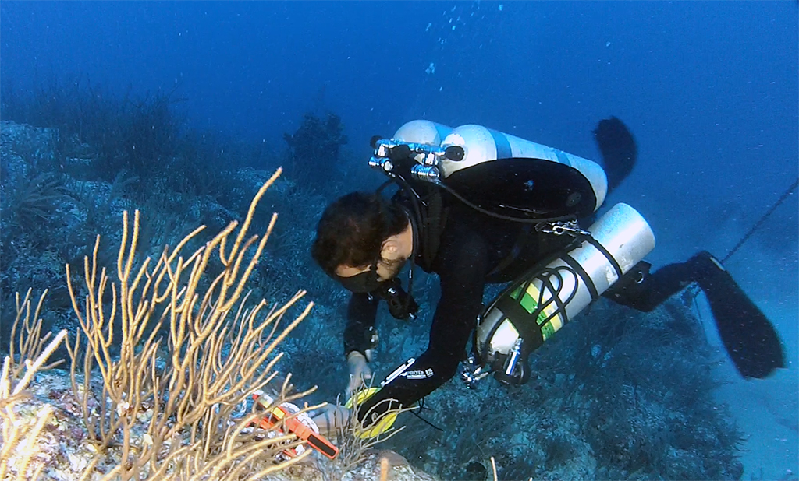 
*Norbert Englebert attaching the transect-line to the reef (video still)* © Global Change Institute - The University of Queensland

---

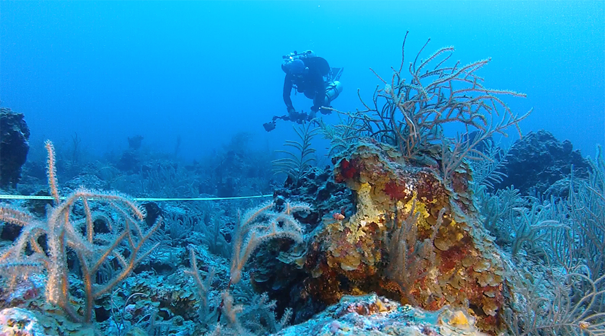 
*David Whillas conducting a photo-transect (40 m) at Princess Beach (video still)* © Global Change Institute - The University of Queensland

---

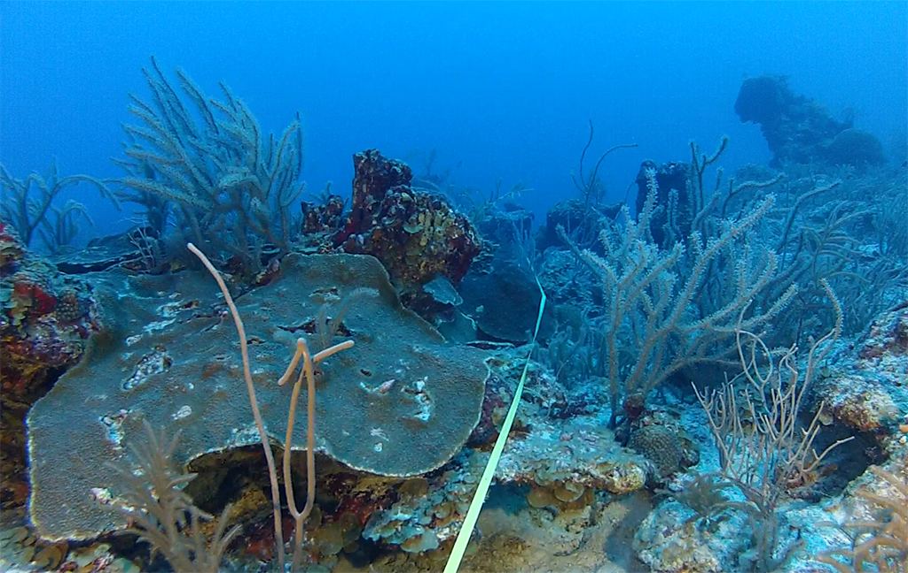 
*A typical deep reef community (40 m) at Princess Beach (video still)* © Global Change Institute - The University of Queensland

---

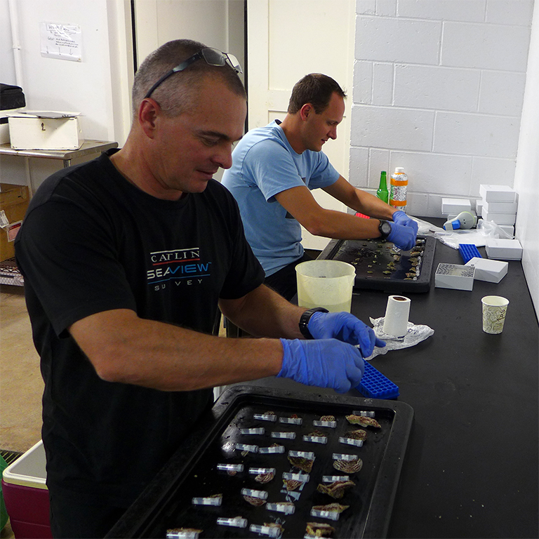 
*David Whillas and Pim Bongaerts processing collected coral samples at BIOS* © Global Change Institute - The University of Queensland

---