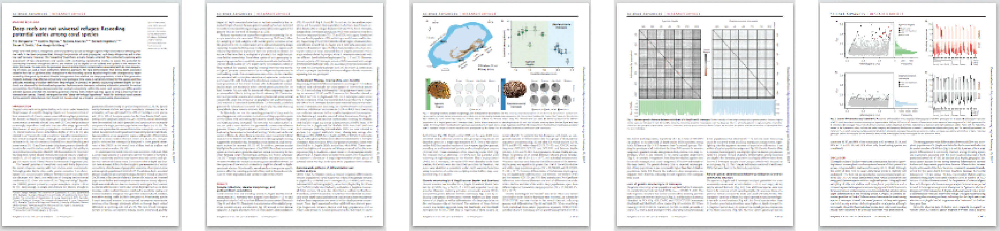
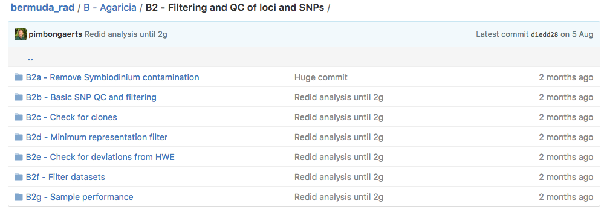
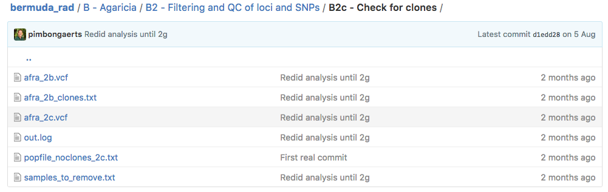

# "Deep reefs are not universal refuges: reseeding potential varies among coral species"

*Manuscript reference:* Bongaerts P, Riginos C, Brunner R, Englebert N, Smith SR, Hoegh-Guldberg O (2016) Deep reefs are not universal refuges: reseeding potential varies among coral species. *Science Advances* 3:e1602373 [[DOI: 10.1126/sciadv.1602373](http://advances.sciencemag.org/content/3/2/e1602373)]

*Electronic lab notebook author:* Pim Bongaerts

## Electronic lab notebook contents

**[A - *Symbiodinium*](/A - Symbiodinium)** - 
Details the analysis of the sequence data for the FACS-isolated *Symbiodinium* that are used as subtraction datasets.

**[B - *Agaricia*](/B - Agaricia/)** - 
Details the processing and analyses of the *Agaricia fragilis* dataset, from raw sequences to eventual population genomic analyses.

**[C - *Stephanocoenia*](/C - Stephanocoenia/)** - 
Details the processing and analyses of the *Stephanocoenia intersepta* dataset, from raw sequences to eventual population genomic analyses.

**[D - Figures](/D - Figures/)** - 
Contains the data and scripts to produce the manuscript figures.

**[E - Scripts](/E - Scripts/)** - 
Several custom scripts (other than those in *[RADseq script library](https://github.com/pimbongaerts/radseq)*) specific to the analysis of the Bermuda dataset.

**[F - Protocols](/F - Protocols/)** - 
Details the lab protocols for gDNA isolation and fluorescence-activated cell sorting.

### Additional resources

**[Raw sequence data (NCBI SRA)](https://www.ncbi.nlm.nih.gov/bioproject/361144)** - Raw Illumina sequence data (fastq format) for the 109 *Stephanocoenia intersepta* and 104 *Agaricia fragilis* coral colonies sequenced in this study (accession code [PRJNA361144](https://www.ncbi.nlm.nih.gov/bioproject/361144)).

**[RADseq script library (GitHub)](https://github.com/pimbongaerts/radseq)** - Separate github repository with generic Python scripts used throughout the electronic lab notebook (A-C).

**[Fieldwork Photos (Gallery)](Fieldwork photos)** - Several photos of the fieldwork in Bermuda

## Explanation
Each (sub)heading in the electronic notebooks (listed above) refers to a directory in the repository, outlining the analysis workflow in sequential order.

Files are marked with a code referring to the directory/step where they were generated. In the example below, the input file `afra_2b.vcf` was produced in the step/directory `B2b - Basic SNP QC and filtering`, and the output file of this step/directory `B2c - Check for clones` is labeled `afra_2c.vcf`.

## Software and dependencies
Besides the Python scripts in the separate [RAD - Python scripts](https://github.com/pimbongaerts/radseq) repository, the analyses depend on the following packages that need to be accessible through the `PATH` environmental variable:

|Package|Version (used)|Type|Note|
|---|---|---|---|
|[PyRAD](https://github.com/dereneaton/pyrad)|3.0.6|Python Application|requires: numpy, scipy, muscle and vsearch|
|[PyVCF](https://github.com/jamescasbon/PyVCF)|0.6.7|Python Module||
|[NumPy](http://www.numpy.org/)|1.11.1|Python Package||
|[BioPython](http://biopython.org/)|1.67|Python Package||
|[vcfR](https://CRAN.R-project.org/package=vcfR)|1.2.0|R Package||
|[hierfstat](https://cran.r-project.org/package=hierfstat)|0.04-22|R Package||
|[adegenet](https://cran.r-project.org/package=adegenet)|2.0.1|R Package||
|[BLAST+](https://blast.ncbi.nlm.nih.gov/Blast.cgi?PAGE_TYPE=BlastDocs&DOC_TYPE=Download)|2.5.0|Executable (CL)|(older versions no longer support remote db connect)|
|[VCFtools](https://vcftools.github.io/)|0.1.15|Executable (CL)||
|[PGDSpider](http://www.cmpg.unibe.ch/software/PGDSpider/)|2.0.5.1|Executable (CL/GUI)|used with a [command-line wrapper](https://github.com/pimbongaerts/radseq/blob/master/vcf_spider.py)|
|[Arlecore](http://cmpg.unibe.ch/software/arlequin35/)|3.5.2.2|Executable (CL)|part of Arlequin package|
|[Lositan](http://popgen.net/soft/lositan/)|1.0.0|Executable (GUI)||
|[BayeScan](http://cmpg.unibe.ch/software/BayeScan/)|2.1|Executable (CL)||
|[STRUCTURE](http://pritchardlab.stanford.edu/structure.html)|2.3.4|Executable (CL/GUI)|used with a [multi-threading wrapper](https://github.com/pimbongaerts/radseq/blob/master/structure_mp.py)|

Additional R packages used for plotting [figures](D - Figures/README.md): [ggplot2](https://cran.r-project.org/package=ggplot2), [reshape2](https://cran.r-project.org/package=reshape2), [gridExtra](https://cran.r-project.org/package=gridExtra), [cowplot](https://cran.r-project.org/package=cowplot), [plyr](https://cran.r-project.org/package=plyr)